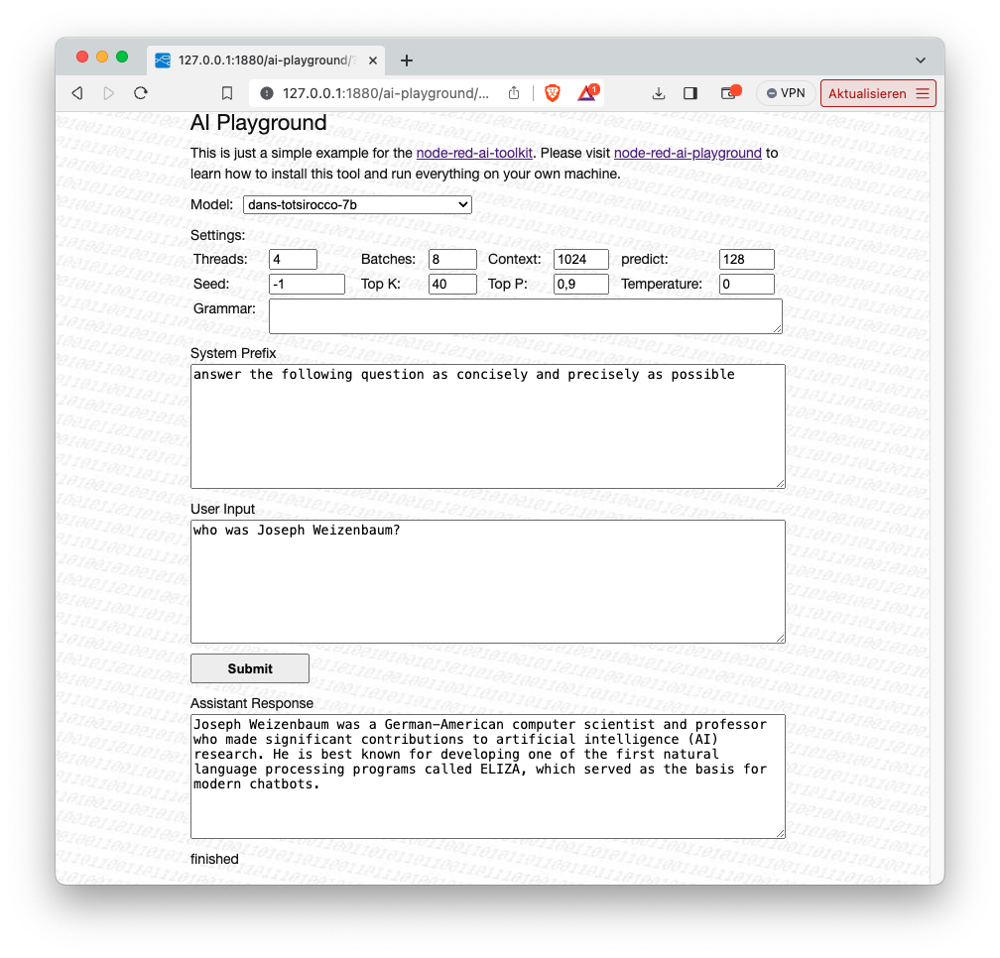
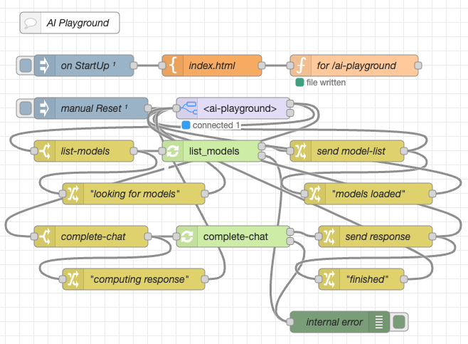

# node-red-ai-playground #

a simple AI LLM Playground based on the Node-RED-AI-Toolkit

This repository contains a [Node-RED](https://nodered.org/) flow which implements a "playground" for AI models. It is primarily intended to serve as an example for the [Node-RED AI Toolkit](https://github.com/rozek/node-red-ai-toolkit), but may also be used on its own.

> **Important**: the AI toolkit and its examples are currently being developed very actively. Come back from time to time and watch out for additional models, better prompts, additional nodes and more robustness. 

> Just a small note: if you like this module and plan to use it, consider "starring" this repository (you will find the "Star" button on the top right of this page), so that I know which of my repositories to take most care of.

## Installation ##

This example requires a running Node-RED instance with installed [Node-RED AI Toolkit](https://github.com/rozek/node-red-ai-toolkit). If not already done, please follow the [installation instructions for the toolkit](https://github.com/rozek/node-red-ai-toolkit#installation) before continuing.

Then, follow the [instructions found in the UIBuilder Docs](https://totallyinformation.github.io/node-red-contrib-uibuilder/#/walkthrough1?id=how-to-get-started-4-steps-to-a-data-driven-web-app) to install the UIBuilder nodes.

Now, it's time to import the contents of file [AI-Playground-Flow.json](https://raw.githubusercontent.com/rozek/node-red-ai-playground/master/AI-Playground-Flow.json) - preferably into a new Node-RD workflow.

If necessary, you may also download a supported AI model (in GGUF format) into the toolkit's model folder.

## Usage ##

UIBuilder and the AI Playground flow will create and manage all files needed for the web frontend. Just navigate your browser to [http://127.0.0.1:1880/ai-web-search](http://127.0.0.1:1880/ai-playground) where `1880` is the port number configured for Node-RED and its flow editor.

The web page should immediately receive a list with all installed AI models - just choose one and configure the desired completion settings. You may even provide a [GBNF grammar](https://github.com/ggerganov/llama.cpp/blob/master/grammars/README.md) the model should follow when computing a text completion.

Finally enter the "system" and "user" parts of a prompt and press "Submit". The model will then generate and display the related "assistant" response.

## License ##

[MIT License](LICENSE.md)
